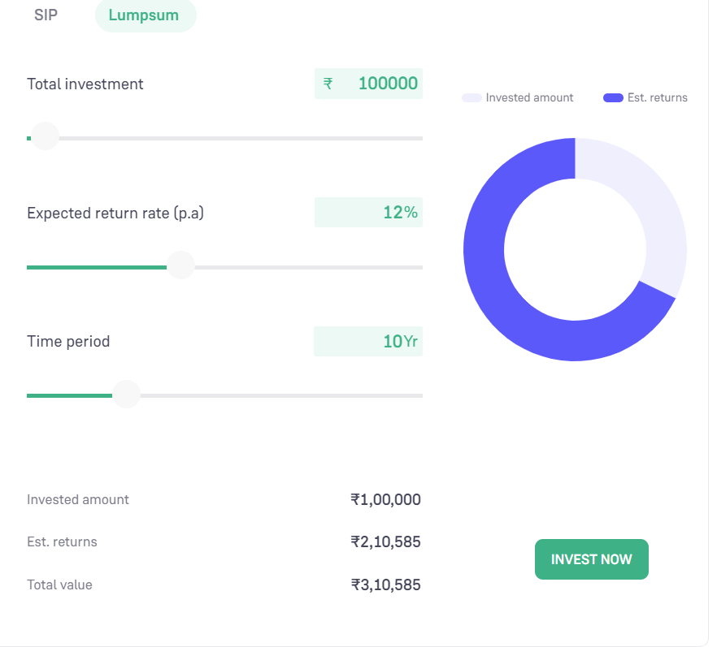

Investment Calculator
---------------------

## Feature 1: Lumpsum Calculator
* Input:  
    * Total Investment
    * Per Annum Rate of Interest
    * Period of Investment in Years

* Output:
    * Invested Amount
    * Estimated Returns
    * Total Value

ref https://groww.in/calculators/lumpsum-calculator

Hint:
  * Usage 'python investment.py lumpsum <total-investment> <interest-rate> <time-period>'
  * to calcualte power '**'
  
 